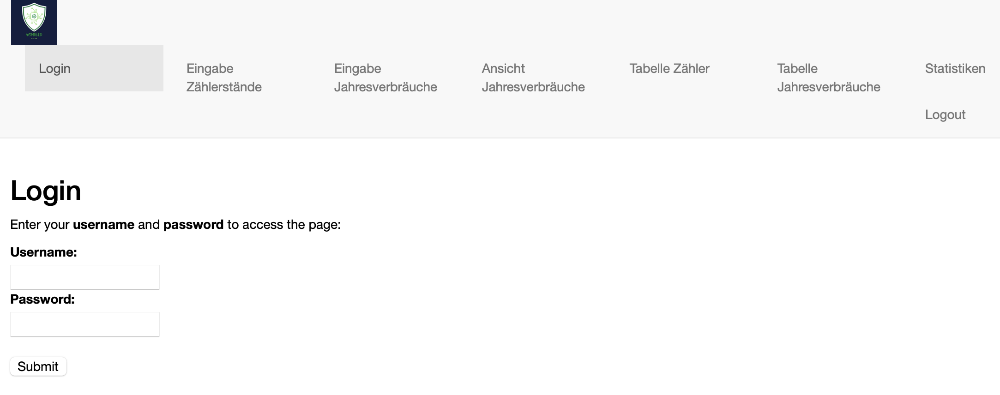
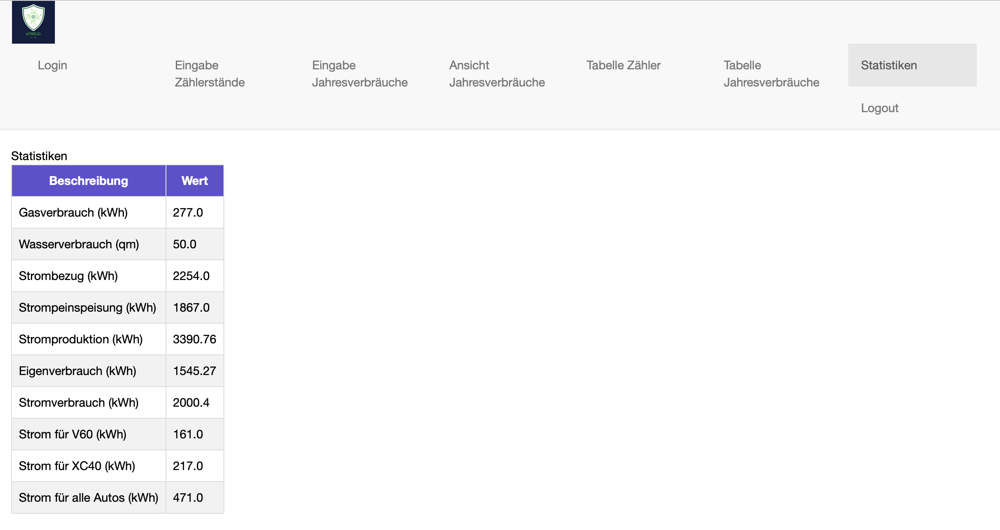

# Resource Logging

Home resource logger for consumables like water gas and electricity.
This project base on a flask WEB interface with multiple pages.

The project can be executed on three drifferent ways:
- as stand-alone flask project locally running
- as docker container: MAC OSX M2 based
- as docker container: Intel based, e.g. Synology


### Web Interface
The software is using flask and bootstrap to build a simple web application. It is using login mechanism controlled by a user dictionary in the my_secrets.py file.
The dialogs are:
- Login:


- Counter (Entry of current counter values):


- Enter Consume over year:


- Consumptions per year (Plot all collected data)


- Table Counter:
  

- Table Consumtions per year
  

- Statistics Table


- Logout (redirects to login)


The values are stored currently in two separate CSV files located in bin folder. The storage and load is encapsulated by database_hdl.py and could be replaced by any other storage methods like SQL databases.

### Build the program and execute
#### Secrets configuration

```python
my_secrets.py:

hostname = "127.0.0.1" # IP address of MQTT broaker
port = 1883 # port of mqtt broaker
client_id = "" # client id of mqtt client
auth = {'username':"user", 'password':"pwd"} # login credentials for mqtt
users = {"user": "pwd"}
```
#### Build and activate Virtual environment
````
source python3 -m venv ha_rec_log_env

pip install -r requirements.txt

source ha_rec_log_env/bin/activate
````
#### Run the application
web interface:
```
python src/app.py  
```

launch configuration for VSCode:
```json
{
    // Verwendet IntelliSense zum Ermitteln möglicher Attribute.
    // Zeigen Sie auf vorhandene Attribute, um die zugehörigen Beschreibungen anzuzeigen.
    // Weitere Informationen finden Sie unter https://go.microsoft.com/fwlink/?linkid=830387
    "version": "0.2.0",
    "configurations": [
        {
            "name": "Python: Flask",
            "type": "python",
            "request": "launch",
            "module": "flask",
            "env": {
                "FLASK_APP": "./src/app.py",
                "FLASK_DEBUG": "1"
            },
            "args": [
                "run",
                "--no-debugger",
                "--no-reload"
            ],
            "jinja": true,
            "justMyCode": true
        }
    ]
}
```

additional settings can be made in parameter.py:
```python
DATA_FOLDER_PATH:str = "./bin/"

# used to run on the mac
#PORT_NUMBER:int = 5050
# used to build the docker container for synology
PORT_NUMBER:int = 5000
#### Using the Docker container
```
build the image:
```
docker build --tag pyth-ha-rec .
```
build the image on a MacBook Air M2 supporting Synology platform:
```
docker build --tag pyth-ha-rec . --platform linux/amd64
```
run the image on the mac M2:
```
docker run --publish 5050:5050 pyth-ha-rec
```
run the image on the synology:
```
docker run --publish 5000:5000 pyth-ha-rec
```
save and deploy the image:
```
docker save -o pyth-ha-rec.tar pyth-ha-rec

```

## TODO
- Update the readme
- build the docker containers in github actions
- publish actual year consumptions to home assistant via MQTT
- 
